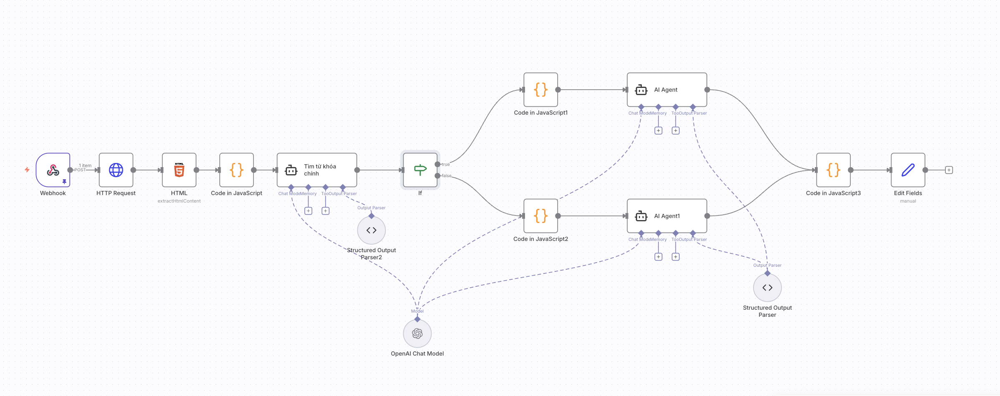
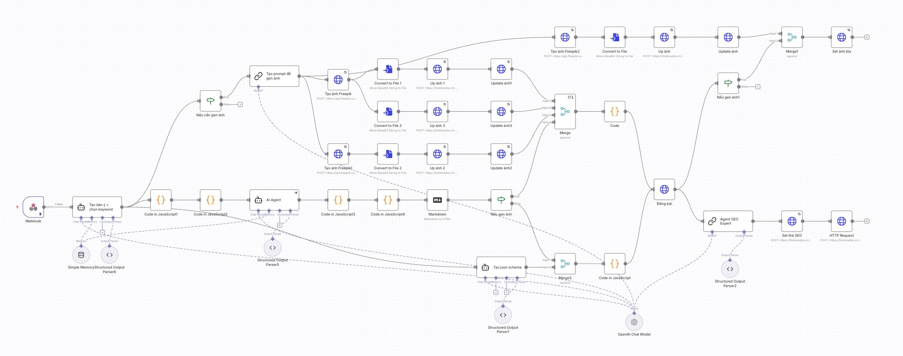

# tindi-wp

## 1. Workflow AI Scraper

Scrape articles from a URL and rewrite content with SEO standards using AI

#### Features
- **Scrape content from URL**: Automatically fetch article list and content from specified URL
- **Smart HTML extraction**: Remove unnecessary elements (images, navigation) and extract only main text content
- **Extract title**: Automatically extract article title from HTML
- **AI processing with OpenAI**: Use GPT-4o to summarize and rewrite content
- **Text chunking**: Automatically split long content into chunks (6000 characters) for more efficient processing
- **Quantity limit**: Can limit the number of articles to process (default 3 articles)
- **Output formatting**: Automatically clean and format data with title, summary and URL

[ai_scraper.json](./n8n/workflow/ai_scraper.json)

## 2. Workflow Tindi Article

Automatically create complete SEO articles from title, including content, images, schema markup and meta tags

#### Features
- **Create detailed content**: Break down outline into sections and AI Agent writes detailed content for each section separately, then automatically merges into a complete article of 1700-2000 words with keyword density of 5-10%, Markdown format
- **Create JSON-LD Schema**: Automatically create schema markup (FAQPage, HowTo) following schema.org standards for SEO optimization
- **AI image generation**: Automatically generate illustration images using Freepik AI API based on article content (optional)
- **Automatic SEO optimization**: Create meta title, meta description, permalink and secondary keywords with AI SEO Expert
- **RankMath integration**: Automatically update meta tags to RankMath SEO plugin
- **Automatic heading numbering**: Automatically renumber headings (H2, H3) in logical order
- **Automatic post publishing**: Automatically publish articles to WordPress with configured status, author, categories
- **Set featured image**: Automatically set the first image as featured image
- **Callback notification**: Send callback to WordPress to notify results

[tindi_article.json](./n8n/workflow/tindi_article.json)

## 3. Workflow chatbot + zalo

Chatbot integrated with Zalo to automatically respond and aggregate customer information and needs

#### Features
- **Auto trigger**: Automatically trigger workflow when receiving messages from personal account or when receiving messages from customers
- **Auto stop when user replies**: When Zalo user replies to customer message, workflow will automatically stop to avoid duplicate responses
- **Timestamp management with Redis**: Use Redis queue to store message timestamps, helping process messages in chronological order and detect when user has replied (compare timestamps to decide to stop workflow)
- **Database** (extended): Use Supabase PostgreSQL to store messages for AI Agent
- **Google Sheet integration**: Automatically aggregate questions and answers to Google Sheet to provide context for AI processing
